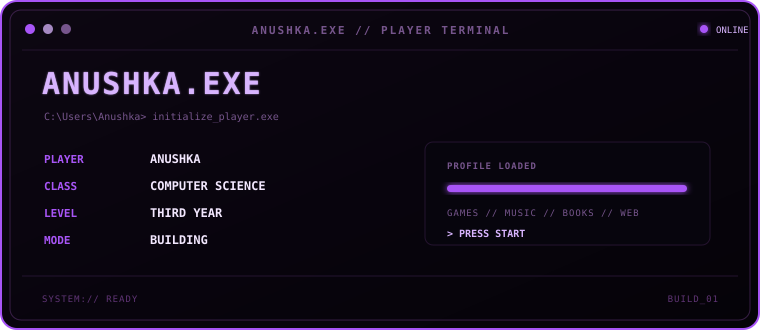
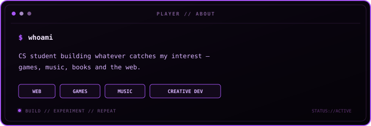
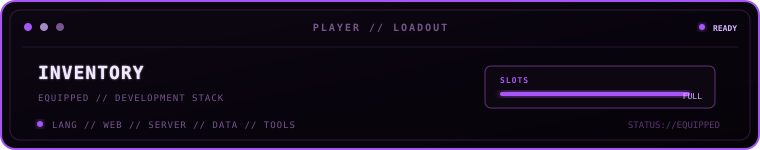
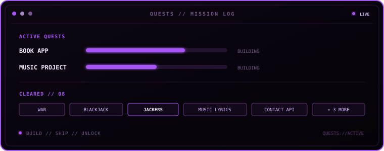
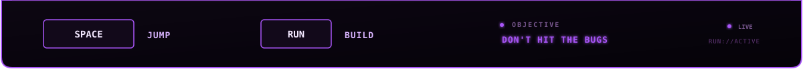
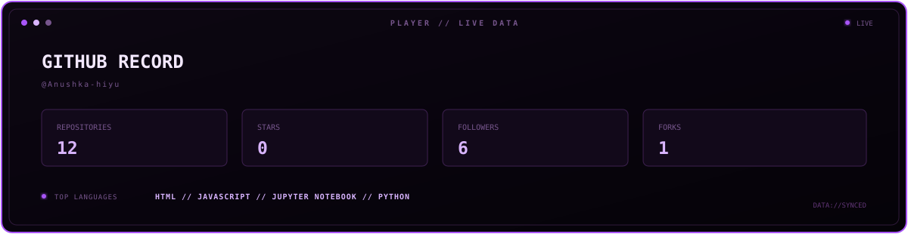
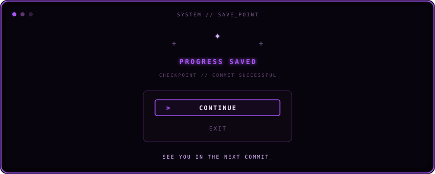

<div align="center">


<br>

<table>
<tr>

<td width="67%" valign="middle">



</td>

<td width="33%" align="center" valign="middle">


<br><br>

<code>ANUSHKA</code>

</td>

</tr>
</table>

</div>

<br>

<table>
<tr>

<td width="67%" valign="middle">



</td>

<td width="33%" align="center" valign="middle">


</td>

</tr>
</table>

<br>

<div align="center">



<br><br>


</div>

<br>

<div align="center">


  
</div>

<br>

<div align="center">

 
</div>

<br>


<div align="center">




</div>

<br>

<div align="center">



</div>

<br>


## `07 // NOW PLAYING`

<div align="center">

<a href="https://open.spotify.com/track/3Ua0m0YmEjrMi9XErKcNiR">
  
</a>

<br><br>

<a href="https://open.spotify.com/track/3Ua0m0YmEjrMi9XErKcNiR">
  
</a>

<a href="https://open.spotify.com/user/31g5ldsc5e36ymhujmg4t4gw43nu">
  
</a>

<br><br>

<sub>♫ JIMIN // FACE // LIKE CRAZY</sub>

</div>


## `> ANIME_INTERMISSION`

<div align="center">


<br><br>

```text
SYSTEM://ANIME_MODE

████████████████████████████████ 100%

                 LOADED.


</div>

---
<br>

<div align="center">


  
</div>
