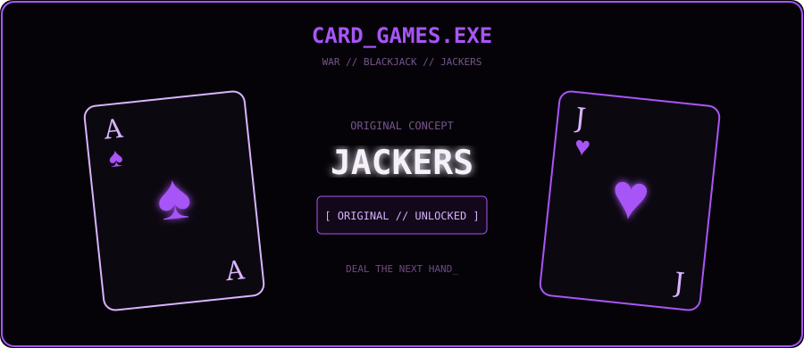
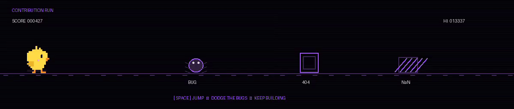
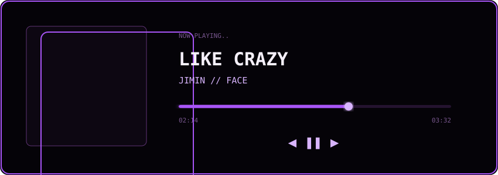

<div align="center">


<br>

<table>
<tr>
<td width="62%" align="center">

```text
╔══════════════════════════════════════╗
║                                      ║
║        PLAYER : ANUSHKA              ║
║        CLASS  : COMPUTER SCIENCE     ║
║        LEVEL  : THIRD YEAR           ║
║        MODE   : BUILDING             ║
║                                      ║
║             > START GAME             ║
║               EXIT                   ║
║                                      ║
╚══════════════════════════════════════╝
```

</td>

<td width="38%" align="center">


<br>

<code>PLAYER_01</code>

</td>
</tr>
</table>

<code>games • music • books • web • code</code>

</div>

---

## `> PLAYER_PROFILE.EXE`

<table>
<tr>

<td width="67%" valign="middle">

```console
anushka@github:~$ whoami

CS student building across games,
music, books and the web.

I like taking ideas past the concept stage —
designing them, building them and figuring
things out along the way.
```

```text
CURRENT      Book App • Music Project

INTERESTS    Web • Games • Music
             Creative Development

FOCUS        Build • Learn • Refine

PLAYING      Like Crazy — Jimin
```

</td>

<td width="33%" align="center" valign="middle">


<br>

<code>SHINOBU.exe</code>

</td>

</tr>
</table>

---

## `> PLAYER_STATS`

<div align="center">

```text
╔══════════════════════════════════════════════╗
║                                              ║
║   PROBLEM SOLVING     █████████░   90%       ║
║   CREATIVITY          ██████████   100%      ║
║   ADAPTABILITY        █████████░   90%       ║
║   LEADERSHIP          █████████░   90%       ║
║   PRESENTATION        █████████░   90%       ║
║   PERSISTENCE         ██████████   100%      ║
║                                              ║
╚══════════════════════════════════════════════╝
```

</div>

---

## `> INVENTORY`

<div align="center">

### `LANGUAGES`


### `FRONTEND`


### `BACKEND`


### `DATABASES`


### `TOOLS`


<br><br>

`[ INVENTORY SAVED ]`

</div>

---

## `> QUEST_LOG`

```text
┌──────────────────────────────────────────────────────────┐
│ PROJECT                      TYPE                STATUS  │
├──────────────────────────────────────────────────────────┤
│ WAR                          Card Game           COMPLETE│
│ BLACKJACK                    Card Game           COMPLETE│
│ JACKERS                      Original Concept    ORIGINAL│
│ MUSIC LYRICS                 Music Project       COMPLETE│
│ COACHING MANAGEMENT SYSTEM   Web Application     COMPLETE│
│ CONTACT MANAGER              Backend / API       COMPLETE│
│ FLASK TODO                   Web Application     COMPLETE│
│ ROCK PAPER SCISSORS          Game                COMPLETE│
└──────────────────────────────────────────────────────────┘
```

<sub>Some completed projects haven't made it to public repositories yet.</sub>

### `CURRENT_QUESTS`

```text
BOOK APP
██████████████░░░░░░     IN DEVELOPMENT

MUSIC PROJECT
██████████░░░░░░░░░░     IN DEVELOPMENT
```

---

<div align="center">

## `> CARD_GAMES.EXE`

 
</div>

---

## `> CONTRIBUTION_RUN.EXE`

<div align="center">



<br>

`[ SPACE ] JUMP`　　`[ RUN ] BUILD`　　`[ OBJECTIVE ] DON'T HIT THE BUGS`

</div>

---

## `> PLAYER_DATA`

<div align="center">


<br>


</div>

---

## `07 // NOW PLAYING`

<div align="center">

<a href="https://open.spotify.com/track/3Ua0m0YmEjrMi9XErKcNiR">
  
</a>

<br><br>

<a href="https://open.spotify.com/track/3Ua0m0YmEjrMi9XErKcNiR">
  
</a>

<a href="https://open.spotify.com/user/31g5ldsc5e36ymhujmg4t4gw43nu">
  
</a>

<br><br>

<sub>♫ JIMIN // FACE // LIKE CRAZY</sub>

</div>

---

## `> ANIME_INTERMISSION`

<div align="center">


<br><br>

```text
SYSTEM://ANIME_MODE

████████████████████████████████ 100%

                 LOADED.
```

</div>

---

## `> SAVE_POINT`

<div align="center">

```text

                  ✦       ✦
                       ✦

                    [ SAVE ]


              PROGRESS SAVED.


        ╔════════════════════════════╗
        ║                            ║
        ║      CONTINUE CODING?      ║
        ║                            ║
        ║           > YES            ║
        ║             NO             ║
        ║                            ║
        ╚════════════════════════════╝


                   GAME SAVED
```

`SYSTEM:// waiting for next commit...`

</div>
